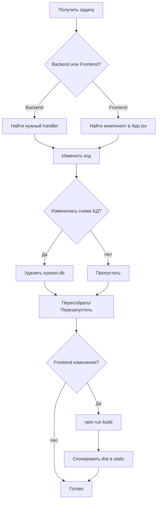

# 🤖 AI Agent Skills & Methodology

## Навыки работы с проектом EyesOn

---

## 📚 Основные скиллы

### 1. Go Backend Development
```yaml
skill: go-fiber-backend
description: Разработка REST API на Go с Fiber framework
files:
  - eyeson-go-server/internal/handlers/*.go
  - eyeson-go-server/internal/routes/routes.go
  - eyeson-go-server/internal/models/db.go
patterns:
  - Handler functions: func HandlerName(c *fiber.Ctx) error
  - Response format: c.JSON(fiber.Map{"data": ...})
  - Error handling: c.Status(code).JSON(fiber.Map{"error": msg})
```

### 2. React/TypeScript Frontend
```yaml
skill: react-typescript-frontend
description: Разработка SPA на React с TypeScript
files:
  - eyeson-gui/frontend/src/App.tsx
  - eyeson-gui/frontend/src/api.ts
patterns:
  - Functional components with hooks
  - useState, useEffect, useCallback, useMemo
  - Bootstrap 5 для стилизации
```

### 3. Database Operations
```yaml
skill: sqlite-gorm
description: Работа с SQLite через GORM ORM
files:
  - eyeson-go-server/internal/database/db.go
  - eyeson-go-server/internal/models/db.go
operations:
  - AutoMigrate для создания таблиц
  - Preload для загрузки связей
  - CRUD операции
```

### 4. Authentication & Authorization
```yaml
skill: jwt-rbac
description: JWT аутентификация с Role-Based Access Control
components:
  - JWT token generation/validation
  - bcrypt password hashing
  - Middleware для проверки ролей
```

---

## 🛠️ Методология работы

### Процесс внесения изменений



### Шаблоны кода

#### Новый API Handler (Go)
```go
type NewRequest struct {
    Field1 string `json:"field1"`
    Field2 int    `json:"field2"`
}

func NewHandler(c *fiber.Ctx) error {
    var req NewRequest
    if err := c.BodyParser(&req); err != nil {
        return c.Status(fiber.StatusBadRequest).JSON(fiber.Map{
            "error": "Invalid request",
        })
    }

    // Business logic here

    return c.JSON(fiber.Map{
        "data": result,
    })
}
```

#### Новый API Endpoint (Routes)
```go
// В routes.go
api.Get("/new-endpoint", handlers.NewHandler)

// С middleware
protected := api.Group("/protected")
protected.Use(handlers.JWTMiddleware)
protected.Use(handlers.RequireAnyRole("Administrator"))
protected.Get("/", handlers.ProtectedHandler)
```

#### Новая API функция (TypeScript)
```typescript
export const NewApiCall = async (params: Params): Promise<Result> => {
    try {
        const token = localStorage.getItem('token');
        const response = await fetch(`${BASE_URL}/endpoint`, {
            method: 'POST',
            headers: { 
                'Content-Type': 'application/json',
                'Authorization': `Bearer ${token}`
            },
            body: JSON.stringify(params)
        });
        
        const data = await response.json();
        if (response.ok) return { success: true, data: data.data };
        return { success: false, error: data.error };
    } catch (e) {
        return { success: false, error: "Network Error: " + e };
    }
};
```

---

## 🔍 Диагностика проблем

### Проблема: API возвращает ошибку

1. **Проверить формат запроса**
   - JSON структура соответствует ожидаемой?
   - Все обязательные поля присутствуют?

2. **Проверить авторизацию**
   - Токен передаётся в заголовке?
   - Токен не истёк?
   - У пользователя есть нужная роль?

3. **Проверить middleware**
   ```go
   // routes.go - проверить цепочку middleware
   users.Use(handlers.JWTMiddleware)
   users.Use(handlers.RequireAnyRole("Administrator"))
   ```

### Проблема: Фронтенд не отображает данные

1. **Проверить формат ответа API**
   ```typescript
   // API должен возвращать { data: [...] }
   const data = await response.json();
   return data.data || [];  // Проверить что берём .data
   ```

2. **Проверить типы TypeScript**
   ```typescript
   // Типы в api.ts должны соответствовать ответу API
   export interface User {
       id: number;
       username: string;
       // ...
   }
   ```

3. **Проверить состояние**
   ```typescript
   // useState правильно типизирован?
   const [users, setUsers] = useState<User[]>([]);
   ```

### Проблема: База данных не обновляется

1. **Удалить файл БД**
   ```powershell
   Remove-Item "eyeson-go-server/eyeson.db" -Force
   ```

2. **Перезапустить сервер** - AutoMigrate создаст новую схему

3. **Seed данные** создадутся автоматически (admin/admin)

---

## 📋 Чеклисты

### Добавление нового API endpoint

- [ ] Создать структуры Request/Response в handler
- [ ] Написать handler функцию
- [ ] Добавить route в routes.go
- [ ] Добавить middleware если нужна авторизация
- [ ] Добавить функцию в api.ts на фронте
- [ ] Обновить типы если нужно
- [ ] Протестировать через curl/PowerShell

### Добавление нового поля в модель

- [ ] Добавить поле в struct в models/db.go
- [ ] Обновить все handlers которые работают с этой моделью
- [ ] Обновить Response структуры
- [ ] Удалить eyeson.db для пересоздания
- [ ] Обновить типы в api.ts
- [ ] Обновить UI компоненты

### Добавление новой страницы/таба

- [ ] Добавить значение в NavPage type
- [ ] Добавить кнопку в навигацию
- [ ] Добавить секцию `{navPage === 'new' && (...)}`
- [ ] Добавить состояния если нужно
- [ ] Добавить функции загрузки данных
- [ ] Собрать и скопировать dist

---

## 🎯 Best Practices

### Go Backend

1. **Всегда валидируй входные данные**
   ```go
   if req.Username == "" {
       return c.Status(400).JSON(fiber.Map{"error": "Username required"})
   }
   ```

2. **Используй транзакции для связанных операций**
   ```go
   tx := database.DB.Begin()
   // операции
   tx.Commit() // или tx.Rollback()
   ```

3. **Логируй важные действия**
   ```go
   log.Printf("[CreateUser] Created user: %s", user.Username)
   ```

### React Frontend

1. **Показывай loading состояние**
   ```tsx
   {loading ? <Spinner /> : <Content />}
   ```

2. **Обрабатывай ошибки**
   ```tsx
   try {
       const result = await ApiCall();
       if (!result.success) showToast(result.error, 'danger');
   } catch (e) {
       showToast('Network error', 'danger');
   }
   ```

3. **Используй мемоизацию для тяжёлых вычислений**
   ```tsx
   const stats = useMemo(() => computeStats(data), [data]);
   ```

---

## 🔗 Полезные команды

### PowerShell

```powershell
# Запуск сервера
$env:PORT = "3000"; cd eyeson-go-server; go run cmd/server/main.go

# Сборка и деплой фронтенда
cd eyeson-gui/frontend; npm run build
Copy-Item -Path "dist/*" -Destination "../eyeson-go-server/static/" -Recurse -Force

# Тест API
$body = @{username='admin';password='admin'} | ConvertTo-Json
$response = Invoke-RestMethod -Uri 'http://127.0.0.1:3000/api/v1/auth/login' -Method Post -Body $body -ContentType 'application/json'
$token = $response.token

$headers = @{Authorization="Bearer $token"}
Invoke-RestMethod -Uri 'http://127.0.0.1:3000/api/v1/users' -Headers $headers

# Очистка БД
Remove-Item "eyeson-go-server/eyeson.db" -Force
```

### Git

```bash
# Коммит изменений
git add .
git commit -m "feat: описание изменения"
git push origin main
```

---

## 📖 Справочник ошибок

| Ошибка | Причина | Решение |
|--------|---------|---------|
| `bind: address already in use` | Порт занят | Убить процесс или сменить порт |
| `Invalid credentials` | Неверный логин/пароль | Проверить данные, пересоздать БД |
| `Access denied: insufficient permissions` | Нет прав | Проверить роль пользователя |
| `Invalid or expired token` | Токен истёк | Перелогиниться |
| `User not found` | Нет пользователя в БД | Проверить ID, пересоздать БД |
| `npm run build fails` | Ошибки TypeScript | Проверить типы, исправить ошибки |
